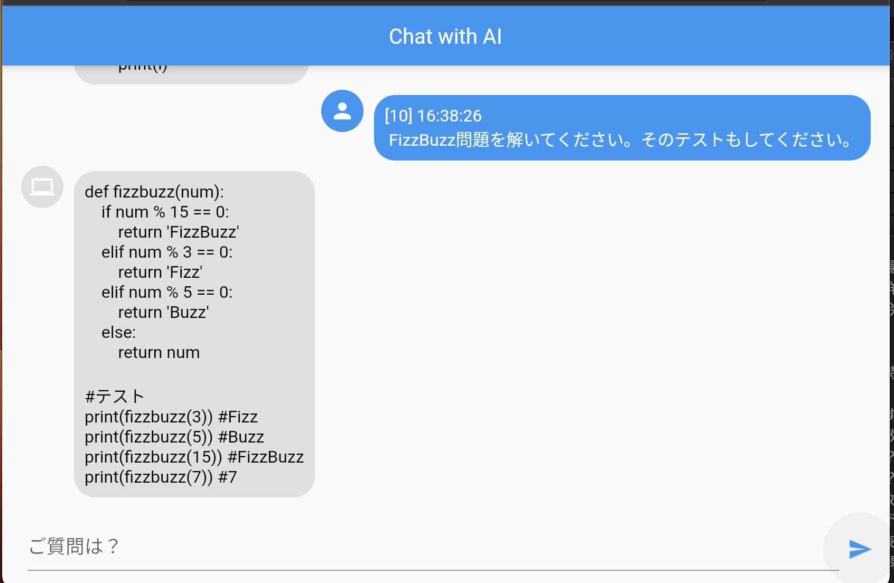
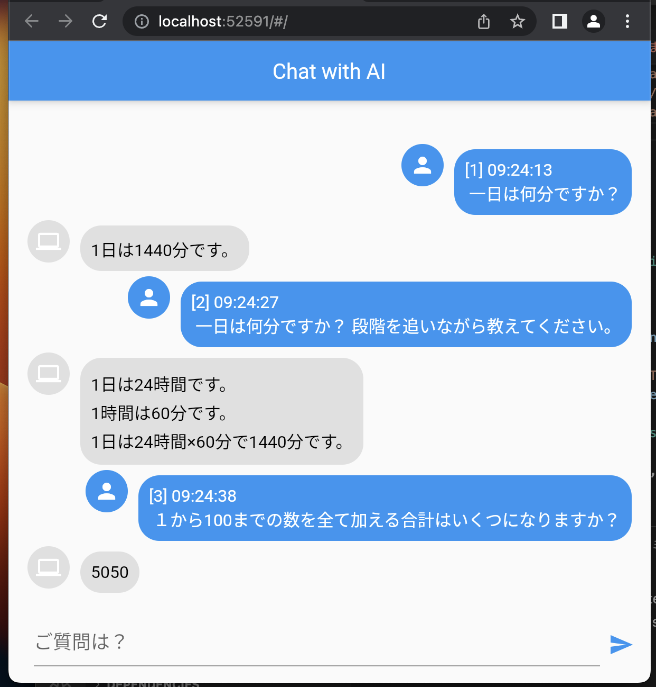
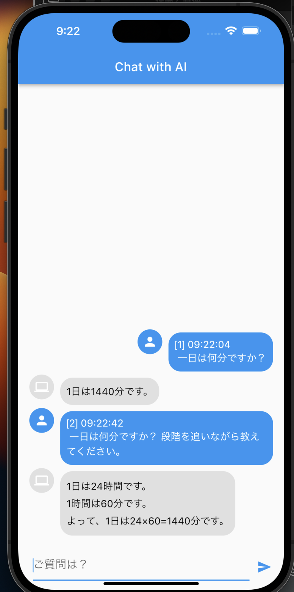

# gpt_sample

A new Flutter project.

## 質問

```text
flutter 3.6 で ChatGPT API を使って対話できるサンプルアプリを作ってください。
ファイル構成は次のようにしてください。

```
- lib/
  - main.dart
  - models/
    - message.dart
  - services/
    - chatgpt_api.dart
  - widgets/
    - chat_bubble.dart
    - chat_screen.dart
```

最初にファイル構成を示してください。
ファイルのコードブロック毎に回答を分割して示してください。
"次を表示" と言ったら、次の回答を示してください。
```

## 設定

```shell
cp .env-sample .env
```

.env に API-KEY を設定します。 "xxxx" の様に "囲んで記述してください。

## スクリーンショット

chrome




- ios

